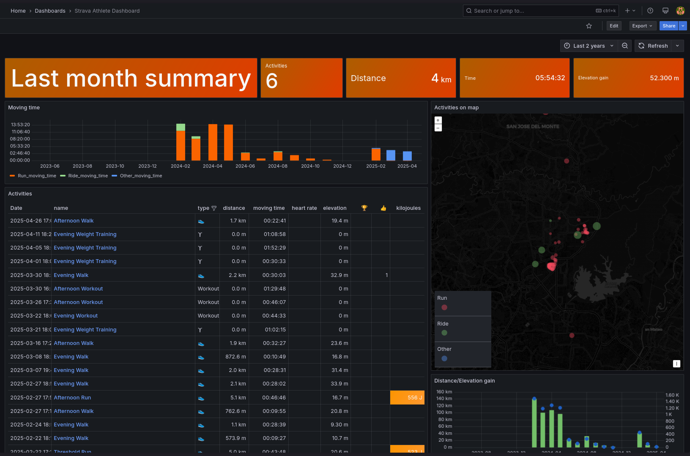

# 🚴 Grafana Strava Integration Infrastructure



This project provisions a **fully scalable infrastructure for Grafana** integrated with **Strava API**, all orchestrated through **Terraform** on AWS. It sets up an automated environment where you can visualize your Strava fitness data through a personalized Grafana dashboard.

**Ideal for**:  
🏃 Runners and cyclists wanting personal analytics  
🛠 Developers learning infrastructure-as-code (IaC)  
💼 Teams needing private, customizable activity monitoring

## 🔎 Overview

- **Terraform** deploys the infrastructure on AWS.
- **Ansible** automates the installation and configuration of servers.
- **Grafana** server provides powerful dashboards for Strava data.
- **NGINX** server in front acts as a **reverse proxy** for Grafana.
- **Elastic IP** is attached to the NGINX EC2 instance for public access.
- **Strava plugin** is configured inside Grafana for activity tracking.

## 🔑 Requirements

- AWS CLI configured
- Terraform installed
- Key Pair (PEM file) to SSH into instances (must be specified in Terraform variables)

## 🏗️ Setup

1. Clone this repository:
    ```bash
    git clone https://github.com/jrzvnn/strava-grafana-infra.git
    cd strava-grafana-infa

    ```
2. Prepare you `terraform.tfvars`:
    ```hcl
    aws_region    = "your-aws-region"
    key_name      = "your-key-pair-name"   # <- PEM key should already exist in AWS
    ami_id        = "your-ami-id"          # Recommended: Amazon Linux 2023
    instance_type = "t2.micro"
    ```
3. Deploy the infrastructure using the `deploy.sh` script:
    ```bash
    sudo ./deploy.sh
    ```
4. Access Grafana:
    - Open your browser and visit `http://<Elastic IP of NGINX EC2>`.
    - Login to Grafana username:`admin` password:`admin` (default).
5. Set up the Strava plugin and start monitoring your fitness data!
    - [Strava Plugin for Grafana](https://grafana.com/grafana/plugins/grafana-strava-datasource/)


## 🎯 Improvements

- [x] Initial Terraform Infrastructure Provisioning
- [x] Manual Grafana, NGINX Setup, and Strava Integration
- [x] Automated Grafana and NGINX Setup via Ansible
- [ ] GitHub Actions for CI Automation of Infrastructure
- [ ] HTTPS and Domain Setup for NGINX Encryption
- [ ] Containerization of the Setup

## 📝 License

This project is licensed under the MIT [LICENSE](LICENSE).

## 💬 Contribute
Feel free to fork, clone, and suggest improvements!

## 💡 Credits
- [Michel van der Zijden - Strava activities in Grafana](https://www.michelvanderzijden.nl/strava-activities-in-grafana/)

---

Made with ❤️  by Joriz
